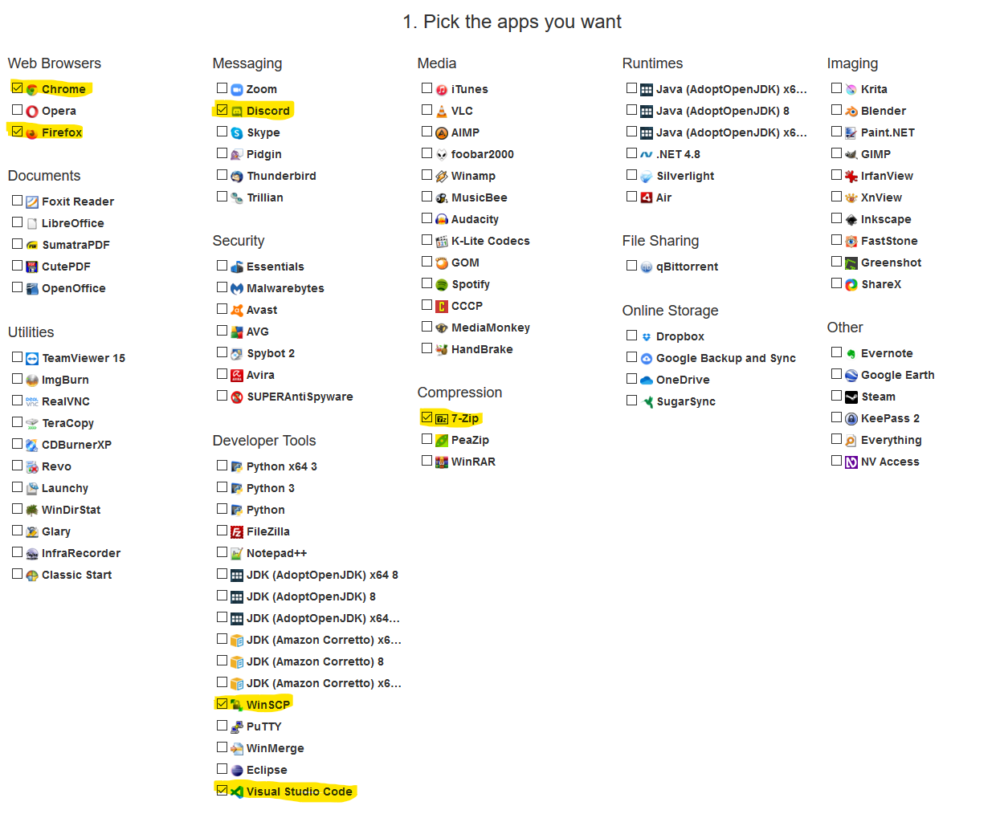
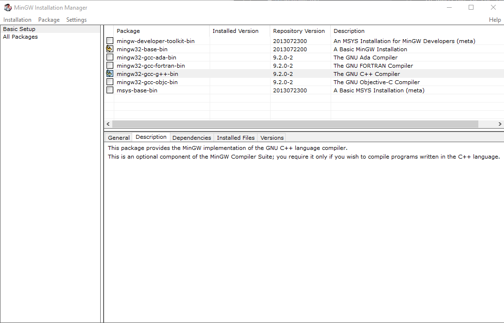
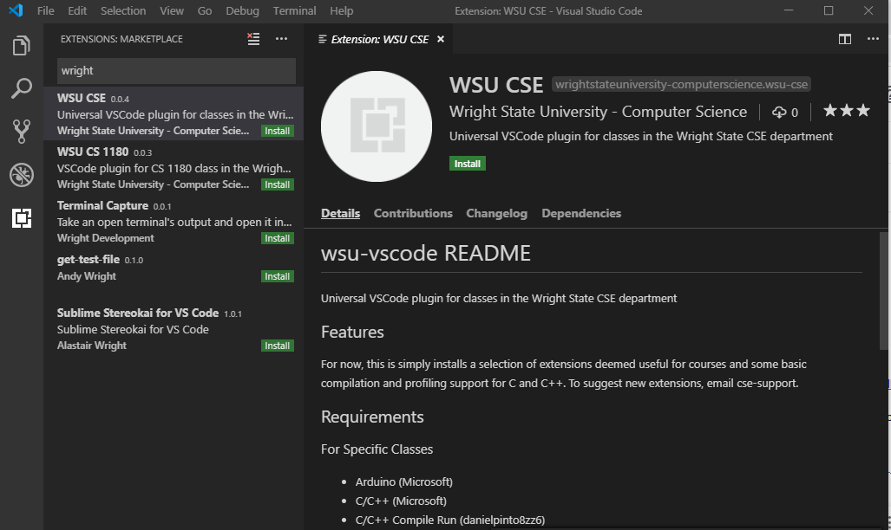

## Wright State CS Dept Setup guide

The purpose of this guide is to get you setup and ready for any software 
requirements that might come at you during your academic career at Wright 
State University.

### Starting point
We're assuming you have a windows 10 system that is fully updated.  There 
will be some Mac and Linux tips towards the end but Mac OS does not support
all fo the needed software in our program (without some paid licenses) and if
you are using linux you should be good to go out of the box (for the most part).

### Getting your system ready for coding

#### Windows system tweaks and installs
* Change your folder options so that you can see hidden files and folders, 
  we're in Computer Scientist, hidden things don't scare us!
* Trackpad settings, down motion schould scroll down, there... I said it, get out
  of here "natural scrolling" (this is obviously a personally prefernce but if you 
  prefer otherwise you might be wrong).
* [Enable Windows Subsystem for Linux.](https://docs.microsoft.com/en-us/windows/wsl/install-win10)
* Install Ubuntu 20.04 from the [Microsoft Store](https://aka.ms/wslstore)

#### Basic Software
There is a great website I have been using for years that downloads and installs
a number of packages without any of the bloatware that typically comes with them.

https://ninite.com/

We will use ninite.com to get the following software:
* Chrome
* Firefox
* Discord
* WinSCP
* Visual Studio Code
* 7-Zip
* Steam... (for games ;)



After you select what you want from the above click "Get Your Ninite" to get 
an installer.  Run that installer to install the selected software for you.

In addition to the tools from ninite, I would strongle recommend [MobaXterm](https://mobaxterm.mobatek.net/download.html).
Mobaxterm provides a great interface to the Windows Subsystem for Linux tools
we installed earlier.  Speaking of, now that Mobaxterm is installed we should 
finish setting up WSL Ubuntu by launching mobaxterm, selecting a WSL ubuntu
terminal, and creating a username and password for our new WSLinux Ubunutu 
install.

#### Language Support
We're only going to focus on three languages here: Java, python, and c++.

* [Java (JDK)](https://adoptopenjdk.net/?variant=openjdk14&jvmVariant=hotspot)
* [Python (Anaconda)](https://repo.anaconda.com/archive/Anaconda3-2020.07-Windows-x86_64.exe)
* [c++ (MinGW)](https://osdn.net/projects/mingw/releases/p15522)



We will test these out later.  More instructions to come on all of these...

#### Git
Next, you will need an account with github, which is free.  Simply head to 
[GitHub.com](https://github.com/) and sign up.  I would recommend using your 
campus email and a professional username and profile pic since this might be a
future portfolio for your internships and job search.

After you create an account I would also install the following:
* [Git for Windows](https://git-scm.com/download/win)
* [GitHub Deskop app](https://desktop.github.com/)

Finally, you may want to bookmark the online [Pro Git](https://git-scm.com/book/en/v2) 
book as it can come in handy when you've royally screwed something up...

#### Configuring Visual Studio Code
Search for Wright in the Extensions tab and install the WSU CSE extension



#### Configuring WSL Ubuntu
Theres a lot to this one so we will start with the basics, this will be built up more 
next week when we do a linux night???
```
sudo apt update
sudo apt install git vim make
```
